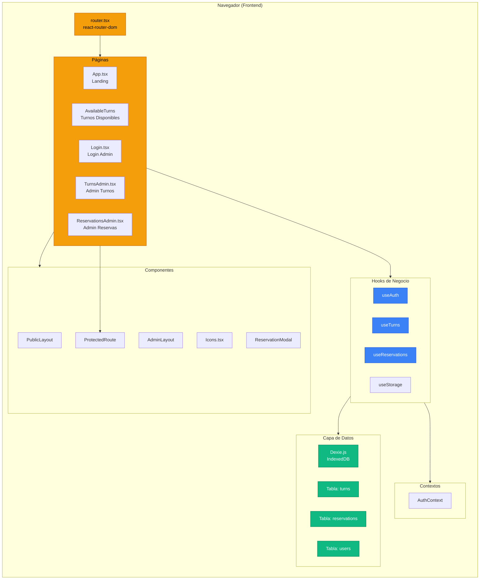
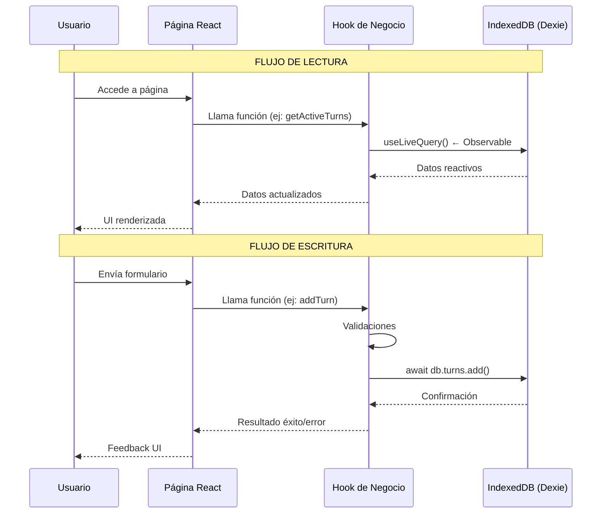
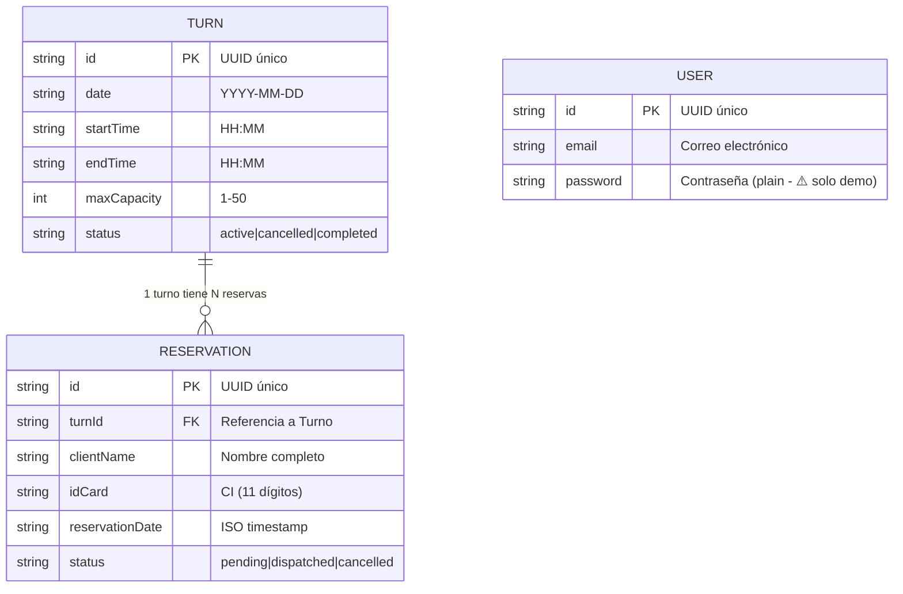
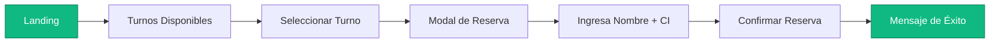
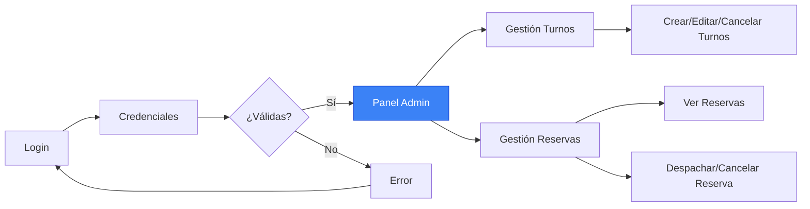

# Servicentro - Sistema de Gestión de Turnos


## 1. Visión General del Proyecto

**Servicentro** es una aplicación web SPA (Single Page Application) desarrollada con **React 18 + TypeScript** que gestiona la cola de suministros de combustible en una estación de servicio (CUPET/Oro Negro). El sistema permite a los clientes reservar turnos de carga de combustible de forma digital, eliminando la espera física innecesaria.

### Características Clave

- **Sin backend**: Toda la información se persiste localmente en **IndexedDB** (Dexie.js)
- **Autenticación admin**: Panel de administración protegido para gestionar turnos y reservas
- **Validaciones estrictas**: Validación de datos en tiempo real tanto en cliente como en hooks

### Stack Tecnológico

| Tecnología | Propósito |
|------------|-----------|
| React 19 | Framework UI |
| TypeScript | Tipado estático |
| Vite | Build tool y dev server |
| Tailwind CSS v4 | Estilos (vía Vite plugin) |
| Dexie.js | Wrapper IndexedDB |
| react-router-dom | Enrutamiento |
| Vitest | Testing |

---

## 2. Estructura del Proyecto

```
servicentro/
├── src/
│   ├── components/        # Componentes UI reutilizables
│   │   ├── Icons.tsx           # Iconos SVG del sistema
│   │   ├── ProtectedRoute.tsx  # Wrapper de rutas protegidas
│   │   └── ReservationModal.tsx # Modal de reserva para clientes
│   │
│   ├── contexts/         # React Context (estado global)
│   │   └── AuthContext.tsx     # Gestión de autenticación admin
│   │
│   ├── db/                # Configuración de base de datos
│   │   ├── database.ts         # Definición Dexie + tablas
│   │   └── seed.ts             # Datos iniciales (si aplica)
│   │
│   ├── hooks/            # Lógica de negocio 
│   │   ├── useAuth.ts           # Re-export de AuthContext
│   │   ├── useTurns.ts         # CRUD Turnos + validaciones
│   │   ├── useReservations.ts  # CRUD Reservas + capacidad
│   │   └── useStorage.ts       # Hook de almacenamiento (legacy)
│   │
│   ├── layouts/          # Layouts de página
│   │   ├── PublicLayout.tsx    # Layout para usuarios públicos
│   │   └── AdminLayout.tsx    # Layout para panel admin
│   │
│   ├── pages/            # Componentes de ruta (views)
│   │   ├── App.tsx             # Página de inicio (landing)
│   │   ├── Login.tsx           # Login de administrador
│   │   ├── AvailableTurns.tsx # Vista pública de turnos
│   │   ├── TurnsAdmin.tsx      # Admin: gestión de turnos
│   │   └── ReservationsAdmin.tsx # Admin: gestión de reservas
│   │
│   ├── types/            # Definiciones TypeScript
│   │   └── index.ts            # Interfaces ITurn, IReservation, IUser
│   │
│   ├── router.tsx        # Configuración de rutas
│   ├── main.tsx          # Entry point React
│   ├── styles.css        # Tailwind + variables CSS
│   └── App.tsx           # Componente raíz
│
├── package.json          # Dependencias y scripts
├── vite.config.ts        # Config Vite + Tailwind
├── tsconfig.json         # Config TypeScript
└── vitest.config.ts      # Configuración de tests
```

---

## 3. Diagramas del Sistema

### 3.1 Arquitectura General



### 3.2 Flujo de Datos



### 3.3 Modelo de Datos (IndexedDB)



### 3.4 Estructura de Rutas

```mermaid
flowchart TB
    subgraph ROUTES["Routes (react-router-dom)"]
        BROWSER["BrowserRouter"]
        
        PUB["PublicLayout (público)"]
        ADMIN["ProtectedRoute → AdminLayout"]
        
        PUB --> "/" ["App.tsx<br/>Landing"]
        PUB --> "/turnos" ["AvailableTurns<br/>Turnos Disponibles"]
        ADMIN --> "/admin/turns" ["TurnsAdmin<br/>Gestión Turnos"]
        ADMIN --> "/admin/reservations" ["ReservationsAdmin<br/>Gestión Reservas"]
        
        LOGIN["/login<br/>Login (público)"]
    end
    
    BROWSER --> PUB
    BROWSER --> LOGIN
    BROWSER --> ADMIN
    
    style ADMIN fill:#dc2626,stroke:#991b1b,color:#fff
    style LOGIN fill:#6366f1,stroke:#4338ca,color:#fff
```

### 3.5 Componentes y Jerarquía

```mermaid
flowchart TB
    subgraph APP["App.tsx"]
        ROUTER["AppRouter"]
    end
    
    subgraph PUBLIC["Rutas Públicas"]
        PL["PublicLayout"]
        HOME["App (Landing)"]
        TURNS["AvailableTurns"]
    end
    
    subgraph ADMIN["Rutas Admin (Protegidas)"]
        PR["ProtectedRoute"]
        AL["AdminLayout"]
        TA["TurnsAdmin"]
        RA["ReservationsAdmin"]
    end
    
    subgraph MODALS["Modales"]
        RM["ReservationModal"]
    end
    
    ROUTER --> PL
    ROUTER --> PR
    ROUTER --> "/login" as LOGIN
    
    PL --> HOME
    PL --> TURNS
    
    PR --> AL
    AL --> TA
    AL --> RA
    
    TURNS --> RM
    
    style PR fill:#dc2626,stroke:#991b1b,color:#fff
    style RM fill:#8b5cf6,stroke:#6d28d9,color:#fff
```

---

## 4. Descripción de Archivos Clave

### 4.1 Tipos (src/types/index.ts)

Define las interfaces TypeScript del dominio:

```typescript
// Turno: Bloque de tiempo para suministro
interface ITurn {
  id: string;           // UUID
  date: string;          // YYYY-MM-DD
  startTime: string;    // HH:MM
  endTime: string;      // HH:MM
  maxCapacity: number;  // 1-50 vehículos
  status: 'active' | 'cancelled' | 'completed';
}

// Reserva: Reserva de cliente
interface IReservation {
  id: string;
  turnId: string;        // FK a Turn
  clientName: string;    // Nombre completo
  idCard: string;       // CI cubano (11 dígitos)
  reservationDate: string; // ISO timestamp
  status: 'pending' | 'dispatched' | 'cancelled';
}

// Usuario admin
interface IUser {
  id: string;
  email: string;
  password: string;
}
```

### 4.2 Base de Datos (src/db/database.ts)

Configura Dexie.js con IndexedDB:

```typescript
class ServicentroDB extends Dexie {
  turns!: Table<ITurn, string>;
  reservations!: Table<IReservation, string>;
  users!: Table<IUser, string>;
  
  constructor() {
    super('servicentro');
    this.version(1).stores({
      turns: 'id, date, status',        // Índices
      reservations: 'id, turnId, idCard, status',
      users: 'id, email',
    });
  }
}

export const db = new ServicentroDB();
```

### 4.3 Hooks de Negocio

**useTurns** (src/hooks/useTurns.ts):
- `getActiveTurns()` → Turnos activos
- `addTurn(data)` → Crear turno (valida overlaps)
- `updateTurn(id, data)` → Actualizar turno
- `deleteTurn(id)` → Eliminar turno
- `cancelTurn(id)` → Cancelar turno
- `completeTurn(id)` → Marcar como completado

**useReservations** (src/hooks/useReservations.ts):
- `addReservation(data)` → Crear reserva (valida capacidad)
- `cancelReservation(id)` → Cancelar reserva
- `dispatchReservation(id)` → Marcar como despachado
- `getAvailableCapacity(turnId, maxCapacity)` → Cupos libres
- `getReservationsByTurn(turnId)` → Reservas de un turno

**useAuth** (src/contexts/AuthContext.tsx):
- `isAuthenticated` → Boolean de estado
- `login(email, password)` → Autenticar admin
- `logout()` → Cerrar sesión

### 4.4 Rutas (src/router.tsx)

Configura el enrutamiento con protección de rutas:

```typescript
// Rutas públicas
<Route element={<PublicLayout />}>
  <Route path="/" element={<App />} />
  <Route path="/turnos" element={<AvailableTurns />} />
</Route>

// Login (público pero fuera de layout)
<Route path="/login" element={<Login />} />

// Rutas protegidas (requiere auth)
<Route element={<ProtectedRoute>}>
  <Route path="/admin/turns" element={<TurnsAdmin />} />
  <Route path="/admin/reservations" element={<ReservationsAdmin />} />
</Route>
```

### 4.5 Componentes de Página

| Página | Propósito | Acceso |
|--------|-----------|--------|
| `App.tsx` | Landing page con navegación | Público |
| `AvailableTurns.tsx` | Ver turnos y reservar | Público |
| `Login.tsx` | Autenticación admin | Público |
| `TurnsAdmin.tsx` | CRUD de turnos | Admin |
| `ReservationsAdmin.tsx` | Ver y gestionar reservas | Admin |

---

## 5. Flujo de Usuario

### 5.1 Cliente (Usuario Público)



### 5.2 Administrador



---

## 6. Reglas de Negocio Importantes

### 6.1 Turnos

1. **Sin overlaps**: No pueden existir dos turnos activos en el mismo horario para la misma fecha
2. **Fecha válida**: No se permiten turnos en fechas pasadas
3. **Capacidad**: Min 1, Max 50 vehículos por turno
4. **Formato hora**: HH:MM (24 horas)

### 6.2 Reservas

1. **Capacidad disponible**: Solo se permite reserva si hay cupos libres
2. **Turno activo**: Solo se puede reservar en turnos con estado `active`
3. **CI válido**: Exactamente 11 dígitos numéricos (formato cubano)
4. **Nombre válido**: Solo letras, espacios, acentos y puntos, 3-100 caracteres

### 6.3 Autenticación

- Credenciales hardcoded: `admin@servicentro.cu` / `admin123`
- Solo para propósito de demo (no usar en producción)
- Persistencia en localStorage

---

## 7. Convenciones de Código

### 7.1 Nombrado

| Elemento | Convención | Ejemplo |
|----------|------------|---------|
| Componentes | PascalCase | `TurnForm.tsx` |
| Hooks | camelCase + `use` | `useTurns.ts` |
| Interfaces | PascalCase + `I` | `ITurn`, `IReservation` |
| Tipos estados | Literal types | `'active' \| 'cancelled'` |
| Archivos utils | camelCase | `dateUtils.ts` |

### 7.2 Import Order

```typescript
// 1. React
import { useState, useEffect } from 'react'

// 2. Third-party
import { useLiveQuery } from 'dexie-react-hooks'
import { useNavigate } from 'react-router-dom'

// 3. Contexts
import { useAuth } from '@/contexts/AuthContext'

// 4. Custom hooks
import { useTurns } from '@/hooks/useTurns'

// 5. Components
import { TurnForm } from '@/components/TurnForm'

// 6. Types
import type { ITurn } from '@/types'

// 7. Utils
import { formatDate } from '@/utils/date'
```

### 7.3 UI en Español

El código interno en inglés, pero la **interfaz de usuario siempre en español**:
- "Turno disponible", "Reservar", "Despachado", "Cancelado"
- Mensajes de error en español
- Fechas en formato local (es-ES)

---

## 8. Scripts Disponibles

```bash
npm install          # Instalar dependencias
npm run dev          # Iniciar dev server (Vite)
npm run build        # Build producción
npm run preview      # Preview producción
npm run lint         # ESLint check
npm run typecheck    # TypeScript check
npm run test         # Ejecutar tests (Vitest)
```

---

## 9. Para Nuevos Desarrolladores

### 9.1 Primeros Pasos

1. **Clona el repositorio** y ejecuta `npm install`
2. **Ejecuta `npm run dev`** para ver la app en localhost
3. **Explora las rutas**:
   - `/` → Landing page
   - `/turnos` → Vista pública de turnos
   - `/login` → Login admin (usa `admin@servicentro.cu` / `admin123`)
   - `/admin/turns` → Gestión de turnos (requiere login)
   - `/admin/reservations` → Gestión de reservas (requiere login)

### 9.2 Añadir Nueva Funcionalidad

1. **Define el tipo** en `src/types/index.ts`
2. **Crea el hook** en `src/hooks/` si hay lógica de negocio
3. **Crea el componente** en `src/components/` o `src/pages/`
4. **Añade la ruta** en `src/router.tsx`
5. **Escribe tests** en `src/test/`

### 9.3 Patrón de Arquitectura

```
Hook (lógica) → Componente (UI) → Página (ruta)
     ↓
  IndexedDB (persistencia)
```

**Regla importante**: La lógica de negocio siempre en hooks, nunca en componentes.

---

## 10. Limitaciones y Notas

- ⚠️ **Sin backend**: Los datos se pierden al limpiar IndexedDB
- ⚠️ **Auth insegura**: Credenciales hardcoded (solo demo)
- ⚠️ **Sin persistencia en servidor**: No hay respaldo de datos
- ✓ **Todo en cliente**: No hay llamadas a APIs externas

