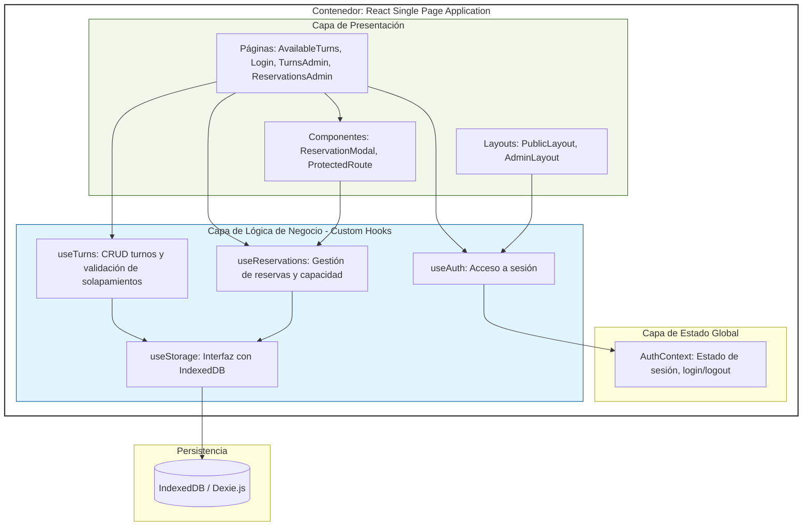

```mermaid
graph TD
    subgraph React_SPA ["Contenedor: React Single Page Application"]
        direction TB
        
        subgraph UI_Layer ["Capa de Presentación"]
            Views["Páginas: AvailableTurns, Login, TurnsAdmin, ReservationsAdmin"]
            Layouts["Layouts: PublicLayout, AdminLayout"]
            Components["Componentes: ReservationModal, ProtectedRoute"]
        end

        subgraph Context_Layer ["Capa de Estado Global"]
            AuthCtx["AuthContext: Estado de sesión, login/logout"]
        end

        subgraph Logic_Layer ["Capa de Lógica de Negocio - Custom Hooks"]
            HookAuth["useAuth: Acceso a sesión"]
            HookTurns["useTurns: CRUD turnos y validación de solapamientos"]
            HookRes["useReservations: Gestión de reservas y capacidad"]
            HookStore["useStorage: Interfaz con IndexedDB"]
        end
    end

    subgraph External ["Persistencia"]
        DB[(IndexedDB / Dexie.js)]
    end

    %% Relaciones
    Views --> HookAuth
    Views --> HookTurns
    Views --> HookRes
    Views --> Components
    Layouts --> HookAuth
    Components --> HookRes

    HookAuth --> AuthCtx
    HookTurns --> HookStore
    HookRes --> HookStore
    HookStore --> DB

    style React_SPA fill:#fff,stroke:#333,stroke-width:2px
    style Logic_Layer fill:#e1f5fe,stroke:#01579b
    style UI_Layer fill:#f1f8e9,stroke:#33691e
```