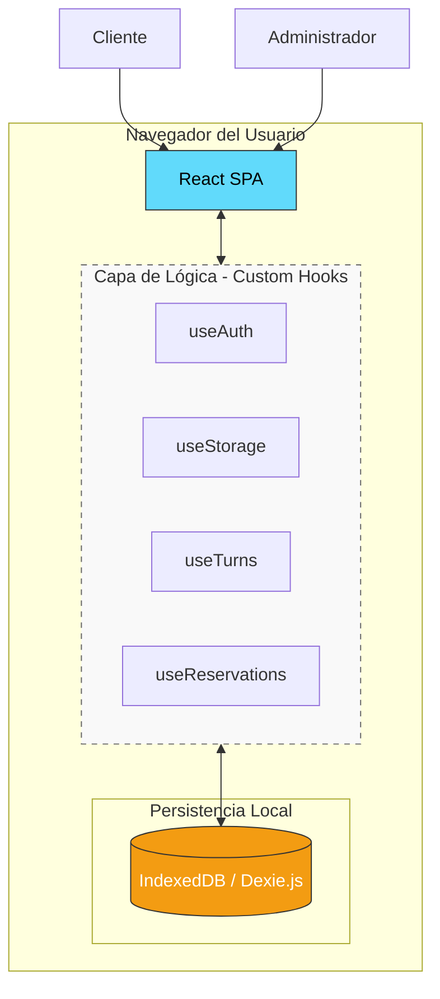

Dentro del navegador, el contenedor principal es la **Single Page Application (SPA)**, que se comunica con el almacenamiento local (**IndexedDB**).

```mermaid
graph TB
    subgraph Client_Browser [Navegador del Usuario]
        direction TB
        
        WebApp[React SPA]
        
        subgraph Storage [Persistencia Local]
            DB[(IndexedDB / Dexie.js)]
        end

        subgraph Logic_Layer [Capa de Lógica - Custom Hooks]
            Auth[useAuth]
            Store[useStorage]
            Turns[useTurns]
            Res[useReservations]
        end

        WebApp <--> Logic_Layer
        Logic_Layer <--> DB
    end

    Public[Cliente] --> WebApp
    Manager[Administrador] --> WebApp

    style WebApp fill:#61dafb,color:#000,stroke:#333
    style DB fill:#f39c12,color:#fff,stroke:#333
    style Logic_Layer fill:#f9f9f9,stroke:#666,stroke-dasharray: 5 5
```