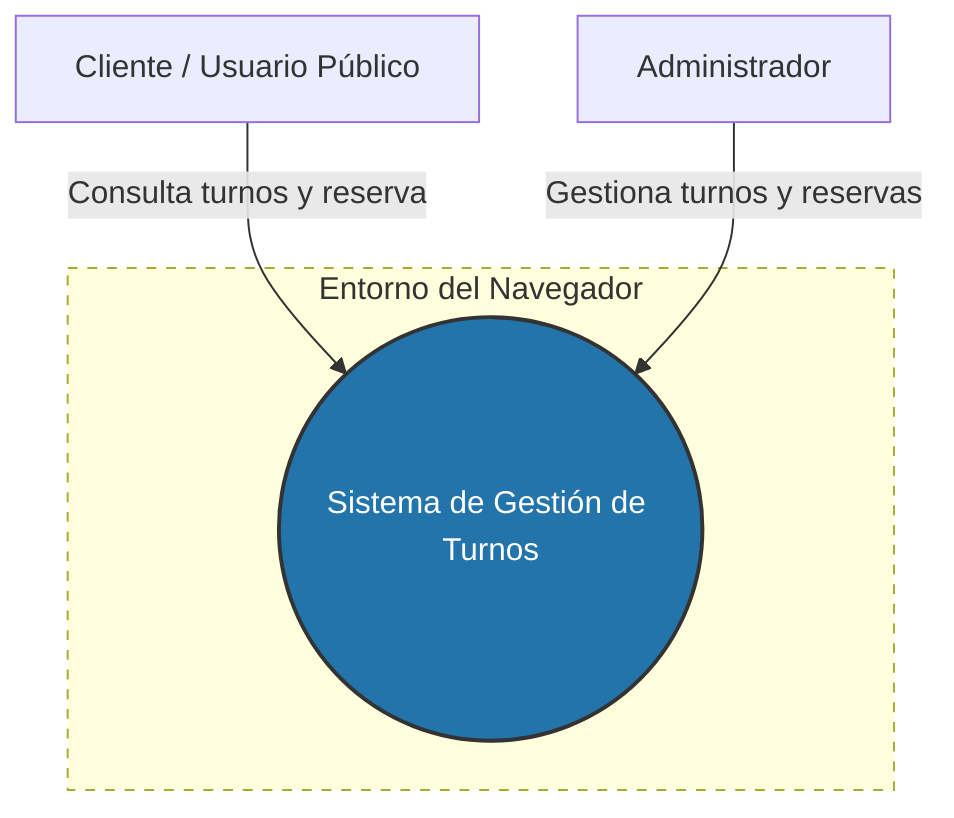

El sistema interactúa únicamente con dos actores: el **Cliente** y el **Administrador**, operando totalmente dentro del **Navegador Web**.

```mermaid
graph TD
    subgraph Browser_Boundary [Entorno del Navegador]
        System((Sistema de Gestión de Turnos))
    end

    User[Cliente / Usuario Público] -- "Consulta turnos y reserva" --> System
    Admin[Administrador] -- "Gestiona turnos y reservas" --> System

    style System fill:#2374ab,color:#fff,stroke:#333,stroke-width:2px
    style Browser_Boundary stroke-dasharray: 5 5
```